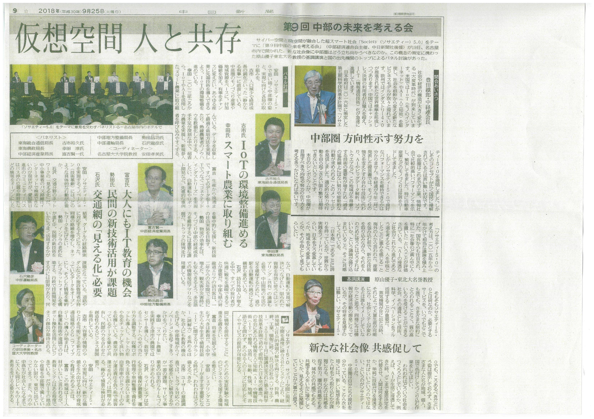

9月19日，中部経済連合会の主催する，第９回中部の未来を考える会「『Society5.0』がもたらす中部圏の新社会像」において，弊研究室の安田先生がパネルディスカッションのコーディネータを務めました．

パネルディスカッションには，
* 総務省東海総合通信局長　古市裕久氏，
* 農林水産省東海農政局長　幸田淳氏
* 経済産業省中部経済産業局長　 富吉賢一 氏
* 国土交通省中部地方整備局長　勢田昌功氏
* 国土交通省中部運輸局長　石澤龍彦 氏
が参加され，現在，日本が進める情報政策であるSociety5.0をテーマとして，中部圏が向かうべき方向性について専門的な議論が行われました．

---

On September 19, Professor Yasuda coordinated panel discussion at the conference sponsored by the Central Japan Economic Federation.

http://www.chukeiren.or.jp/news/2018/08/society5019-1.html

