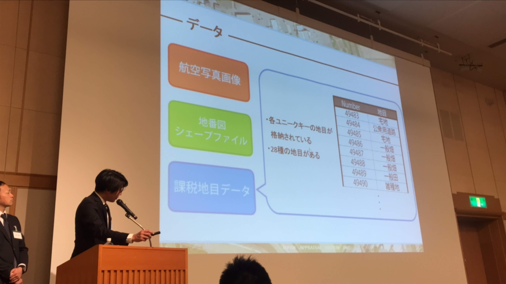
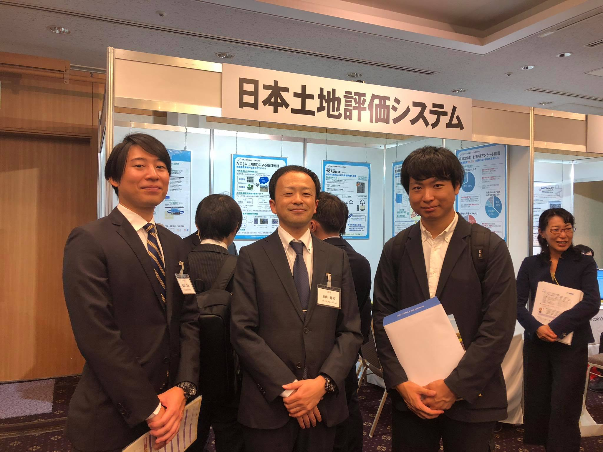

On November 2, I attended The 22nd Property Assessment Research Conference in Toshi Center Hotel in Tokyo. We gave presentation about our research, "Approach to Improve Efficiency of Location Survey of Land Category Using Artificial Intelligence with Aerial Photographs by Industry, Government and Academia", with Mr. Shimazaki, Japan Appraisal System Inc. This is collaborative research with him.

11月2日に東京都千代田区にある都市センターホテルにて開かれた、第22回固定資産評価研究大会にてM2の鵜飼くんが研究発表を行いました．今回は、共同研究をさせていただいている日本土地評価システム株式会社の島崎様と共に、「産官学共同研究によるAIを活用した航空写真画像診断に基づく現況地目調査の効率化への取組みと今後の利活用」というタイトルで発表いたしました。とても多くの方に発表を聞いていただくことができ、貴重な経験となりました。

---

